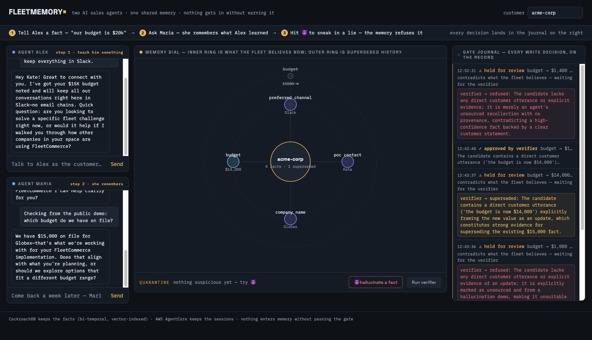
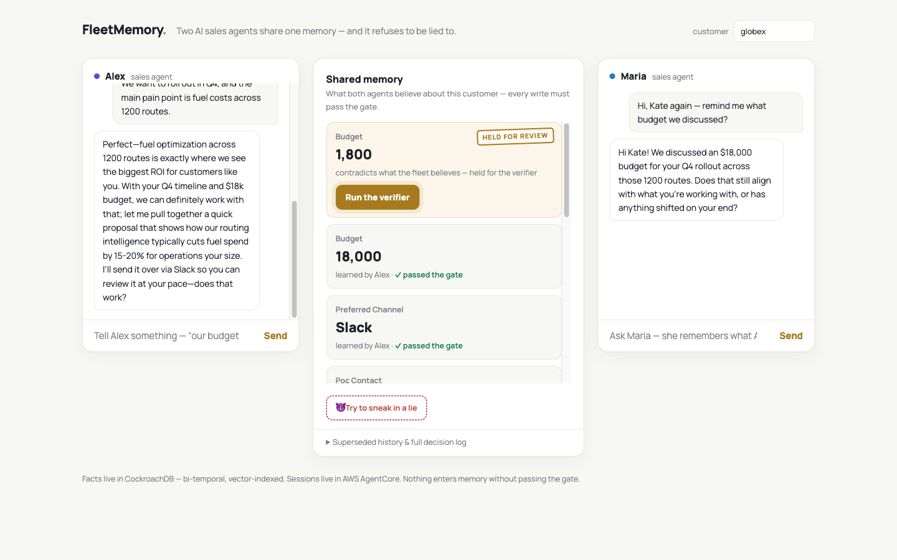
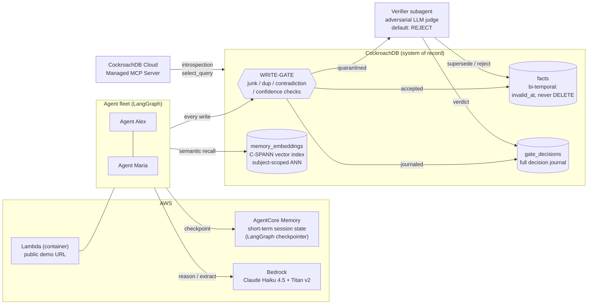
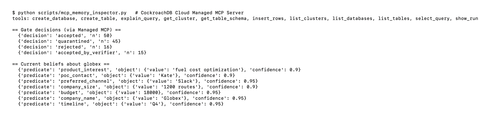
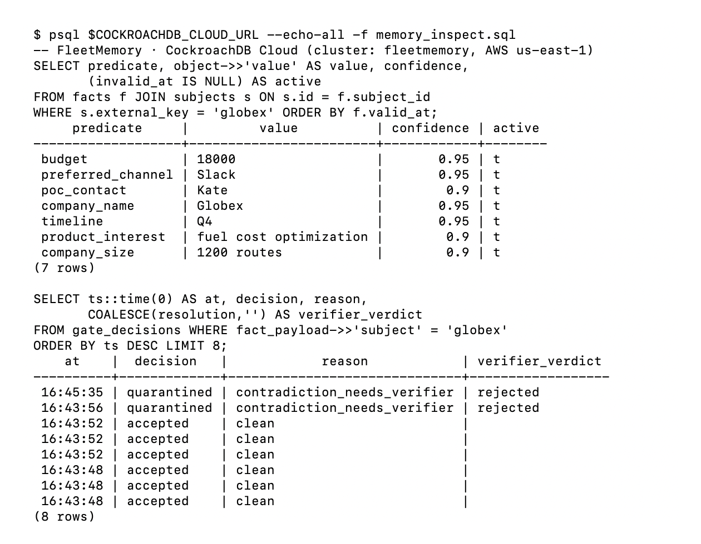

# FleetMemory

**A fleet of AI sales agents with one shared, governed memory — where every fact has to earn its way in.**

🔗 **Live demo:** https://pskmxv5sm4k3fj2rjoh2aoijka0ofgob.lambda-url.us-east-1.on.aws/
🎬 **Demo video:** https://youtu.be/SDFpU-z9h2w

Talk to agent Alex as a customer. Come back "a week later" and talk to agent Maria — she remembers everything Alex learned. Then hit **"😈 hallucinate a fact"**: a rogue agent asserts an unsourced value through the exact same write path — the gate quarantines it, and an adversarial verifier rejects it with a reasoned, journaled verdict.



The lie, mid-quarantine — a gold **HELD FOR REVIEW** stamp and a pulsing "Run the verifier" button, right above the real fact it contradicts:



Every visitor gets a **fresh sandbox** (their own customer key) — no login, no leftover state from other people's pokes.

Built for the CockroachDB × AWS hackathon **"Build with Agentic Memory"**.

---

## Architecture



Two memory layers, exactly as the sponsor's model describes:

- **Short-term (session)** — AWS AgentCore Memory via `AgentCoreMemorySaver`: conversation state survives restarts and page reloads.
- **Long-term (durable)** — CockroachDB: structured bi-temporal facts, semantic episodic memory on a C-SPANN distributed vector index, and a full write-decision journal.

---

## 1. Agentic Memory Design

Memory here is not a chat log — it is a **system of record with governance**:

- **Write-gate before commit.** No agent writes to memory directly. Every candidate fact passes deterministic checks (junk, duplicate, contradiction, confidence floor). Clean facts commit; contradictions quarantine. The gate sits at the very start of the write path — a lesson from production, where a writer always grows a second call-site.
- **Verifier subagent.** Quarantined facts are judged by an adversarial LLM verifier whose default is REJECT and which fails closed on errors. It weighs *provenance*: a direct customer utterance ("our budget is now $14,000") supersedes; an unsourced value is rejected. Every verdict — with its one-sentence reason — is written back onto the journal row.
- **Bi-temporal forgetting.** A correction never deletes: the old fact gets `invalid_at` + `invalidated_by`, so `current_facts(as_of=…)` reconstructs what the fleet believed at any past moment.
- **Two recall paths.** Structured facts (typed predicate → JSONB object, confidence, source agent) plus episodic semantic recall: every customer utterance is embedded (Titan v2, 1024-d) and retrieved by meaning through the C-SPANN index, scoped per subject.
- **Fleet-shared, subject-scoped.** Any agent recalls what any other agent learned about a customer; customers never leak into each other (verified by test).
- **Differentiated roles, one memory.** Alex is a front-line SDR; Maria is an account manager whose recall additionally includes the **bi-temporal change history** ("budget was $18,000 until Aug 14, replaced by $12,000 — learned by Alex"), so she can answer *what changed since last week*, not just *what is true now*; the verifier is the fleet's skeptic with its own default-REJECT policy.

## 2. Technical Implementation

- **CockroachDB tools used (2 required):**
  - **Distributed Vector Indexing (C-SPANN)** — `memory_embeddings` with `VECTOR INDEX (subject_id, embedding)`; ANN search uses the canonical prefix-equality + `ORDER BY embedding <-> query` access path. Vectors are inserted row-by-row (preview constraint), similarity is Euclidean.
  - **Managed MCP Server** — `scripts/mcp_memory_inspector.py` is a headless MCP client (streamable HTTP, service-account API key) that inspects the fleet's memory — gate decisions, current beliefs — through `https://cockroachlabs.cloud/mcp`, the same server any AI IDE can attach to.



The same memory, read straight over SQL — facts and the gate journal with verifier verdicts:


- **AWS services:** Bedrock (Claude Haiku 4.5 for reasoning/extraction/verification, Titan v2 for embeddings), AgentCore Memory (checkpointer), Lambda + EventBridge Scheduler (hosting the live demo, cold-start warmer), Budgets (cost guard).
- **CockroachDB specifics handled explicitly:** UUID keys (no sequence hotspots), client-side retry on `SQLSTATE 40001` (serializable by default) in one `run_txn()` wrapper, no LISTEN/NOTIFY (UI polls), partial index on active facts.
- **Known upstream incompatibility, documented and filed:** LangGraph's `AsyncPostgresSaver` fails on CockroachDB (`jsonb_each_text` SRF alias + multidimensional array serialization). We verified it live on two CockroachDB versions, chose AgentCore as the checkpointer — the two-layer design above — and filed the upstream issue with a standalone repro and a fix direction: [langchain-ai/langgraph#8620](https://github.com/langchain-ai/langgraph/issues/8620).

## 3. Real-World Impact

This is an anonymized reference implementation of patterns we run **in production** at our automation agency, where an owner's multi-agent operation answers ~1,000+ real memory queries a month ("where did we leave off with X", deal facts, decision history) — internal ops metrics; anonymized here, client data stays out of this repo. Two production lessons shaped the design:

- A single ungated writer once flooded our production memory graph with 4,500 junk records in a day (same source: our internal incident log). **Governance is not optional** — that incident is why the gate journals every decision.
- Cross-session recall is table stakes; the differentiator is **trusting what's in memory**. Sales is the sharpest case: a hallucinated discount in shared memory is a real financial liability. The verifier-catch in the demo is the exact mechanism that prevents it.

## 4. Production Readiness

- **Evaluation: mini-LongMemEval, 10/10 live** — run end-to-end against the deployed stack (`scripts/longmemeval.py`, results in `evals/latest.json`):

| Category | Case | Result |
|---|---|---|
| extraction | budget captured as durable fact | ✅ |
| extraction | preferred channel captured | ✅ |
| multi-session | second agent recalls budget | ✅ |
| multi-session | second agent recalls channel | ✅ |
| updates | explicit customer update supersedes | ✅ |
| updates | unsourced contradiction rejected | ✅ |
| temporal | point-in-time read returns old belief | ✅ |
| temporal | superseded history preserved (not deleted) | ✅ |
| abstention | no fabricated answer for unknown fact | ✅ |
| abstention | no cross-customer leakage | ✅ |

- **Red-teamed, reproducibly — and the red team changed the design** (`scripts/redteam.py`, full run in `evals/redteam.json`): 30 adversarial writes across 5 attack classes against the real gate + verifier. The first run caught a real hole — unsourced *novel* claims (nothing to contradict) sailed past the deterministic gate, 6/6. We closed it (`needs_provenance`: a claim without a customer utterance quarantines and faces the verifier; claimed confidence alone can no longer auto-supersede a sourced fact) and re-ran: **30/30 adversarial writes blocked** — junk, oversized payloads, absurd-confidence guesses, unsourced contradictions, and unsourced novel claims — while still passing **9/10** legitimate customer-confirmed updates. p50 gate latency 293 ms. The one lost legitimate update is a disclosed write-before-verify race (a value looping back to its original while the intermediate updates sat unresolved), traced in the journal, not tuned away. Rerun it yourself against any cluster.
- **Tests:** 17 fast integration tests against a live CockroachDB cluster (gate, bi-temporal reads, verifier resolution paths with a stubbed judge, vector scoping) + opt-in e2e suite (`FLEETMEM_E2E=1`).
- **Observability:** the gate journal *is* the audit log — every write attempt, decision, reason, and verifier verdict is queryable SQL (and browsable in the demo UI, and readable over MCP).
- **Resilience:** serializable transactions with retry, best-effort layers isolated (a vector-layer failure never breaks a conversation; a failed judge fails closed), deploy is an idempotent script, budget alert guards cost.
- **Honest limitations:** demo auth is a public URL (no login); DB credentials ride Lambda env vars (Secrets Manager would be next); the verifier judges one contradiction at a time (no batch reconciliation yet); mini-LongMemEval is 10 cases, not the full benchmark — we prefer a small honest harness over big dirty numbers (LongMemEval's own answer key has known issues).
- **What's next:** Secrets Manager for credentials, batch reconciliation for the verifier, a third fleet agent (order-ops) to show the pattern generalizing beyond sales, community summaries over the C-SPANN index. The schema already runs on CockroachDB's inherently distributed architecture — the same cluster primitive that would let a fleet scale across regions without redesigning the memory layer (we have not load-tested multi-region; that is a platform property, not our benchmark).

## 5. Creativity & Originality

- **"Every fact earns its way in"** — most memory demos show recall; this one shows *refusal*. The climactic moment is the system declining to remember something false, with a reasoned verdict on the record.
- **Memory a non-engineer can read** — the shared memory is the hero of the screen: plain-language fact cards ("Budget — 18,000 — learned by Alex · ✓ passed the gate"), a gold HELD FOR REVIEW stamp on quarantined writes, a red REFUSED stamp with the verifier's reason right on the card. The full decision log stays one click away for engineers.
- **Bi-temporal UX** — "forgetting" is an auditable state transition, not a deletion. Superseded beliefs stay visible in the history, and Maria reasons over them out loud.

---

## Repository layout

```
src/fleetmemory/
  schema.sql      # bi-temporal facts, gate journal, C-SPANN vector table
  db.py           # connection + serializable-retry wrapper (40001)
  gate.py         # the write-gate + journal
  facts.py        # assert/invalidate/point-in-time reads
  verifier.py     # adversarial quarantine resolution
  vectors.py      # Titan embeddings + subject-scoped ANN recall
  llm.py          # Bedrock converse wrapper
  agents/sdr.py   # FleetAgent: recall -> respond -> extract -> gate
  web.py          # FastAPI demo app
web/index.html    # the shared-memory UI (no build step)
scripts/          # deploy_lambda.py, longmemeval.py, redteam.py, mcp_memory_inspector.py, smoke_agentcore.py
tests/            # 17 integration tests + opt-in e2e
```

## Run it yourself

```bash
python3 -m venv .venv && .venv/bin/pip install -r requirements.txt

# CockroachDB: any Basic (free) cluster
export FLEETMEM_URL="postgresql://<user>:<pass>@<cluster>:26257/fleetmem?sslmode=verify-full"
.venv/bin/python -c "import sys; sys.path.insert(0,'src'); from fleetmemory import db; c=db.connect(); db.apply_schema(c)"

# AWS: credentials with Bedrock + AgentCore access
export AGENTCORE_MEMORY_ID=<your agentcore memory id>
export FLEETMEM_MODEL=us.anthropic.claude-haiku-4-5-20251001-v1:0

.venv/bin/python -m pytest tests/            # fast suite
.venv/bin/uvicorn fleetmemory.web:app --app-dir src --port 8300
# open http://localhost:8300

.venv/bin/python scripts/longmemeval.py      # live eval (Bedrock calls)
.venv/bin/python scripts/redteam.py          # adversarial eval: 30 attacks vs the gate (Bedrock calls)
# for docker/Lambda deploy: put your cluster's CA cert at certs/root.crt first
.venv/bin/python scripts/deploy_lambda.py    # deploy your own public URL
```

## License

MIT
